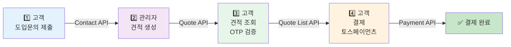
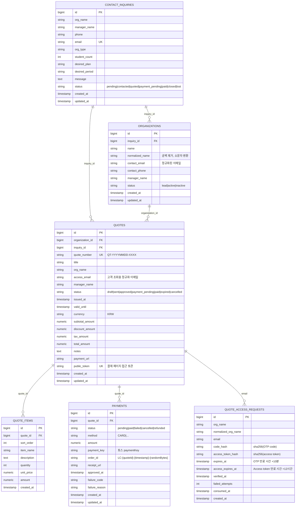
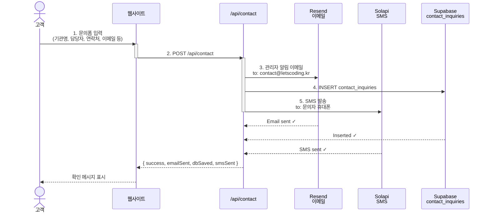
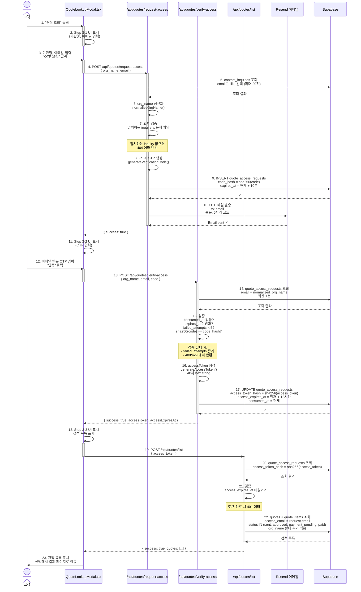
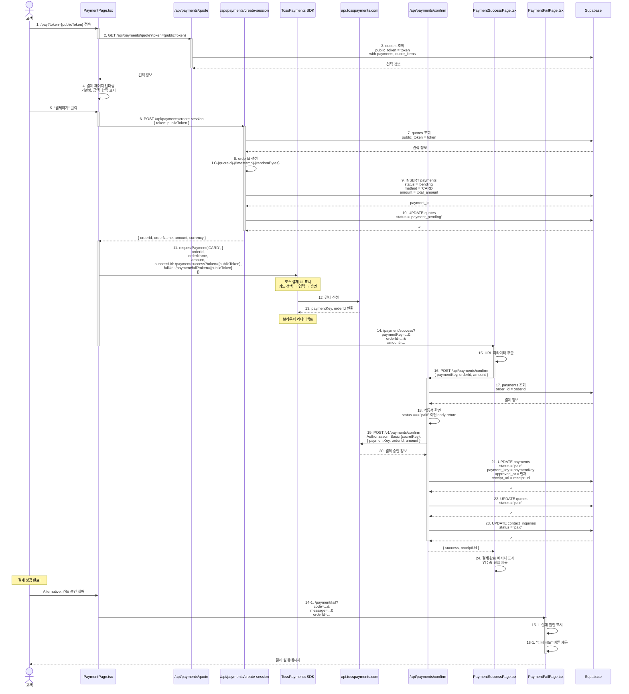
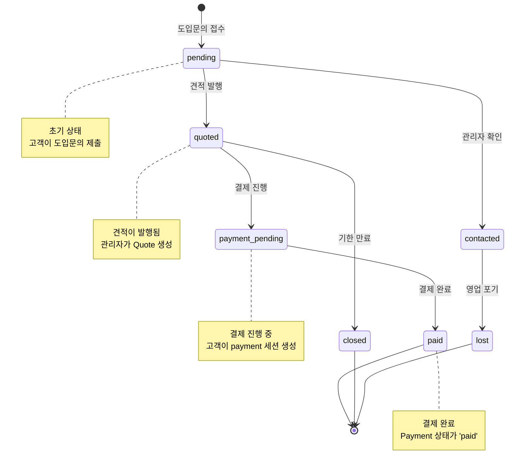
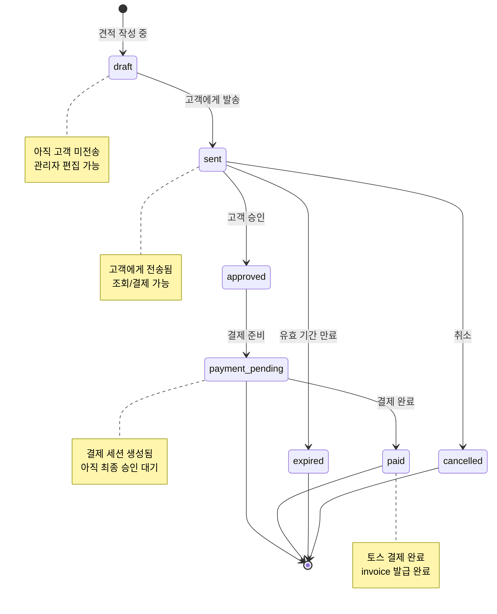
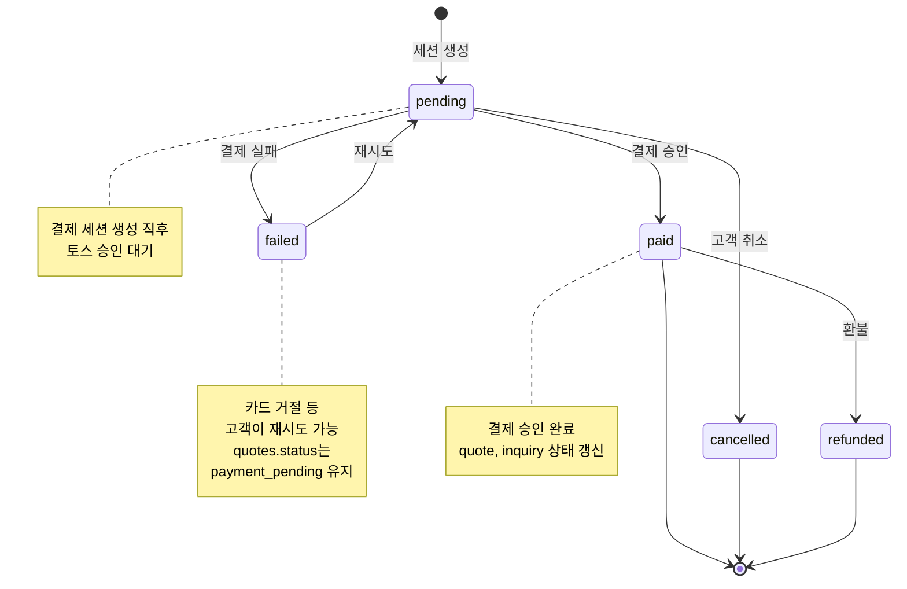
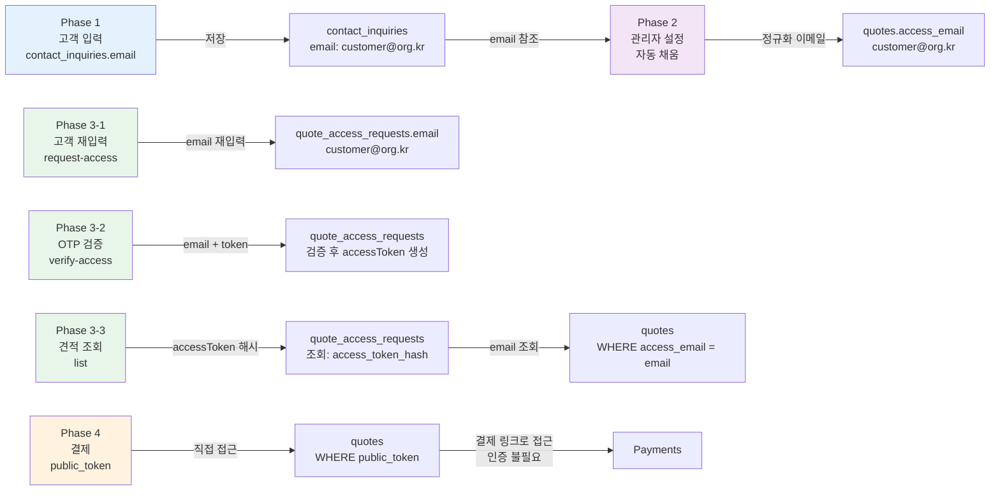

# 비즈니스 프로세스 흐름 가이드

도입문의부터 결제까지 전체 비즈니스 프로세스를 설명합니다.

**목차**
- [전체 프로세스 개요](#전체-프로세스-개요)
- [데이터베이스 구조](#데이터베이스-구조)
- [Phase 1: 도입문의 (고객 → 시스템)](#phase-1-도입문의-고객--시스템)
- [Phase 2: 관리자 견적 생성 (관리자 → 시스템)](#phase-2-관리자-견적-생성-관리자--시스템)
- [Phase 3: 견적 조회 (고객 → 시스템)](#phase-3-견적-조회-고객--시스템)
- [Phase 4: 결제 (고객 → 토스페이먼츠)](#phase-4-결제-고객--토스페이먼츠)
- [상태 관리](#상태-관리)
- [이메일을 통한 데이터 연결](#이메일을-통한-데이터-연결)
- [API 엔드포인트 목록](#api-엔드포인트-목록)
- [환경 변수 설정](#환경-변수-설정)
- [디버깅 가이드](#디버깅-가이드)

---

## 전체 프로세스 개요



### 4단계 프로세스

| 단계 | 구분 | 역할 | 주요 테이블 | 상태 변화 |
|------|------|------|-----------|---------|
| **Phase 1** | 도입문의 | 고객 입력 | `contact_inquiries` | `pending` |
| **Phase 2** | 견적 생성 | 관리자 작성 | `quotes`, `quote_items`, `organizations` | `pending` → `quoted` |
| **Phase 3** | 견적 조회 | 고객 OTP 검증 | `quote_access_requests` | OTP 생성/검증 |
| **Phase 4** | 결제 처리 | 토스 결제 | `payments` | `payment_pending` → `paid` |

---

## 데이터베이스 구조

### ER 다이어그램



### 주요 인덱스

```sql
-- organizations
CREATE INDEX organizations_normalized_name_idx ON organizations(normalized_name);
CREATE INDEX organizations_contact_email_idx ON organizations(contact_email);

-- quotes
CREATE INDEX quotes_access_email_idx ON quotes(access_email);
CREATE INDEX quotes_org_name_idx ON quotes(org_name);
CREATE INDEX quotes_status_idx ON quotes(status);
CREATE INDEX quotes_public_token_idx ON quotes(public_token);

-- quote_items
CREATE INDEX quote_items_quote_id_idx ON quote_items(quote_id, sort_order);

-- quote_access_requests
CREATE INDEX quote_access_requests_lookup_idx ON quote_access_requests(email, normalized_org_name, created_at DESC);
CREATE INDEX quote_access_requests_token_idx ON quote_access_requests(access_token_hash);

-- payments
CREATE INDEX payments_quote_id_idx ON payments(quote_id, created_at DESC);
```

---

## Phase 1: 도입문의 (고객 → 시스템)

### 흐름도



### 프론트엔드

- **파일**: `src/components/ContactModal.tsx`
- **버튼**: "문의 보내기"
- **입력 필드**:
  - 기관명 (필수)
  - 담당자 이름 (필수)
  - 전화번호 (필수)
  - 이메일 (필수)
  - 기관 유형 (필수): 학교, 사설학원, 기업 등
  - 학생 수 (선택)
  - 희망 플랜 (선택)
  - 희망 기간 (선택)
  - 기타 문의 내용 (선택)

### API: POST /api/contact

**경로**: `api/contact.ts`

**요청**
```json
{
  "org_name": "XXX 초등학교",
  "manager_name": "김담당자",
  "phone": "010-1234-5678",
  "email": "contact@school.kr",
  "org_type": "학교",
  "student_count": 500,
  "desired_plan": "베타",
  "desired_period": "3개월",
  "message": "자세한 문의 내용..."
}
```

**응답** (성공 200)
```json
{
  "success": true,
  "emailSent": true,
  "dbSaved": true,
  "smsSent": true
}
```

**응답** (실패 500)
```json
{
  "error": "서버 오류가 발생했습니다."
}
```

### 동작 상세

#### Step 1: Resend로 관리자 알림 이메일 발송
- **수신자**: `contact@letscoding.kr` (고정)
- **발신자**: `${RESEND_FROM_NAME} <${RESEND_FROM_EMAIL}>`
- **제목**: `[도입문의] ${org_name} - ${manager_name}`
- **본문**: 입력 정보를 테이블 형식으로 표시
- **실패 처리**: 로그에 기록하지만 응답을 차단하지 않음 (`emailSent = false`)

#### Step 2: Supabase에 문의 정보 저장
- **테이블**: `contact_inquiries`
- **상태**: `status = 'pending'` (자동)
- **저장 필드**:
  - `org_name`, `manager_name`, `phone`, `email`, `org_type`
  - `student_count`, `desired_plan`, `desired_period`, `message` (모두 nullable)
- **실패 처리**: 로그에 기록하지만 응답을 차단하지 않음 (`dbSaved = false`)

#### Step 3: Solapi로 문의자에게 확인 SMS 발송
- **수신자**: 입력받은 `phone` (하이픈 제거)
- **발신자**: `SOLAPI_SENDER_NUMBER` 환경변수
- **메시지**: `[렛츠코딩] {manager_name}님, 도입 문의가 정상 접수되었습니다. 빠른 시일 내 연락드리겠습니다.`
- **실패 처리**: 로그에 기록하지만 응답을 차단하지 않음 (`smsSent = false`)

### 실패 조건

- **emailSent = false AND dbSaved = false**: 500 에러 반환
- **기타 경우**: 성공 응답 (부분 실패 허용)

### 데이터베이스 상태

| 컬럼 | 값 |
|------|---|
| `status` | `pending` |
| `created_at` | 현재 시간 |
| `updated_at` | 현재 시간 |

---

## Phase 2: 관리자 견적 생성 (관리자 → 시스템)

### 흐름도

```mermaid
sequenceDiagram
    actor Admin as 관리자
    participant AdminUI as admin.html<br/>AdminApp.tsx
    participant AdminAPI as /api/admin/*
    participant AuthLib as admin-auth.ts
    participant QuoteAPI as /api/admin/quotes
    participant DB as Supabase<br/>여러 테이블

    Admin->>AdminUI: 1. admin.html 접속
    activate AdminUI
    AdminUI->>AdminUI: 2. 도입문의 목록 조회<br/>sidebar 표시
    Admin->>AdminUI: 3. 문의 선택
    AdminUI->>AdminUI: 4. 문의 상세 정보 표시<br/>자동 채움: email, manager_name

    Admin->>AdminUI: 5. 견적 항목 입력<br/>금액 계산
    activate AdminUI
    AdminUI->>AdminUI: 자동 계산:<br/>subtotal = sum(quantity × unit_price)<br/>tax = subtotal × 10%<br/>total = subtotal - discount + tax
    deactivate AdminUI

    Admin->>AdminUI: 6. "견적 발행" 클릭
    AdminUI->>QuoteAPI: 7. POST /api/admin/quotes<br/>x-admin-key 헤더 포함

    activate QuoteAPI
    QuoteAPI->>AuthLib: 8. validateAdminRequest()
    AuthLib-->>QuoteAPI: ✓ 인증 성공

    QuoteAPI->>DB: 9. getOrCreateOrganization()<br/>normalized_name + contact_email<br/>dedup으로 조회/생성
    DB-->>QuoteAPI: organization_id

    QuoteAPI->>DB: 10. 견적번호 생성<br/>QT-YYYYMMDD-XXXX
    QuoteAPI->>DB: 11. public_token 생성<br/>36자 hex random
    QuoteAPI->>DB: 12. payment_url 생성<br/>/pay?token={publicToken}

    QuoteAPI->>DB: 13. INSERT quotes
    DB-->>QuoteAPI: quote_id

    QuoteAPI->>DB: 14. INSERT quote_items<br/>CASCADE 삭제 설정
    DB-->>QuoteAPI: ✓

    QuoteAPI->>DB: 15. UPDATE contact_inquiries<br/>status = 'quoted'
    DB-->>QuoteAPI: ✓
    deactivate QuoteAPI

    QuoteAPI-->>AdminUI: { success, quoteId, quoteNumber }
    AdminUI-->>Admin: 견적 발행 완료<br/>발행된 견적 목록 갱신

    Admin->>AdminUI: 7-1. 결제 링크 복사<br/>clipboard 복사
    or
    Admin->>AdminUI: 7-2. 견적 수정: PATCH /api/admin/quotes<br/>기존 quote_items 모두 삭제 후 재생성
    or
    Admin->>AdminUI: 7-3. 견적 삭제: DELETE /api/admin/quotes?id=N<br/>contact_inquiries.status = 'contacted'로 리셋
```

### 프론트엔드

- **파일**: `admin.html` 진입점
- **메인 컴포넌트**: `src/AdminApp.tsx`
- **화면 구성**:
  - **좌측 사이드바**: 도입 문의 목록 (최신순, 200건 제한)
    - 문의 선택 시 우측에 상세 정보 표시
    - 각 문의의 상태 표시 (pending, contacted, quoted, payment_pending, paid, closed, lost)
  - **우측 상단**: 선택된 문의 상세 + 상태 수동 변경
  - **우측 좌측**: 견적 생성/수정 폼
    - 기관명 (자동 채움, 수정 불가)
    - 담당자 (자동 채움)
    - 접근 이메일 (자동 채움, 수정 가능)
    - 견적명 (입력)
    - 견적 항목 (추가/삭제)
      - 항목명, 설명, 수량, 단가 입력
      - 금액 자동 계산
    - 부분합, 할인, 부가세(10%), 총액 표시
    - 발행 상태, 발행 일시, 유효 기간 설정
  - **우측 우측**: 발행된 견적 목록
    - 견적번호, 상태, 총액, 발행 일시
    - 결제 링크 복사
    - 수정 / 삭제 버튼

### API: 관리자 인증

**헤더**: `x-admin-key: {ADMIN_DASHBOARD_KEY}`

**파일**: `api/_lib/admin-auth.ts`

```typescript
export function validateAdminRequest(req: VercelRequest) {
  const configuredKey = process.env.ADMIN_DASHBOARD_KEY;
  if (!configuredKey) return true; // 미설정 시 모든 요청 허용

  const providedKey = req.headers['x-admin-key'];
  return typeof providedKey === 'string' && providedKey === configuredKey;
}
```

모든 관리자 API (`/api/admin/*`)는 이 검증을 거쳐야 합니다.

### API: GET /api/admin/inquiries

**경로**: `api/admin/inquiries.ts`

**쿼리 파라미터**
```
GET /api/admin/inquiries?inquiry_id=123
```

**응답** (성공 200)
```json
{
  "success": true,
  "quotes": [
    {
      "id": 1,
      "inquiry_id": 123,
      "quote_number": "QT-20260320-1234",
      "title": "학교 프로그래밍 교육",
      "org_name": "XXX 초등학교",
      "access_email": "contact@school.kr",
      "manager_name": "김담당자",
      "status": "sent",
      "total_amount": 5000000,
      "public_token": "abc123...",
      "created_at": "2026-03-20T10:30:00Z",
      "quote_items": [
        {
          "id": 1,
          "item_name": "3개월 기본 플랜",
          "quantity": 1,
          "unit_price": 5000000,
          "amount": 5000000
        }
      ],
      "payments": []
    }
  ]
}
```

### API: POST /api/admin/quotes

**경로**: `api/admin/quotes.ts`

**요청**
```json
{
  "inquiry_id": 123,
  "title": "학교 프로그래밍 교육",
  "access_email": "contact@school.kr",
  "manager_name": "김담당자",
  "status": "sent",
  "issued_at": "2026-03-20T10:30:00Z",
  "valid_until": "2026-06-20T23:59:59Z",
  "currency": "KRW",
  "subtotal_amount": 5000000,
  "discount_amount": 0,
  "tax_amount": 500000,
  "total_amount": 5500000,
  "notes": "추가 노트",
  "items": [
    {
      "item_name": "3개월 기본 플랜",
      "description": "학생 100명 기준",
      "quantity": 1,
      "unit_price": 5000000,
      "amount": 5000000
    }
  ]
}
```

**응답** (성공 201)
```json
{
  "success": true,
  "quoteId": 1,
  "quoteNumber": "QT-20260320-1234"
}
```

**응답** (실패 400)
```json
{
  "error": "문의, 견적명, 이메일, 견적 항목은 필수입니다."
}
```

### API: PATCH /api/admin/quotes

**경로**: `api/admin/quotes.ts`

**요청** (POST와 동일하지만 `id` 필드 포함)
```json
{
  "id": 1,
  "title": "수정된 견적명",
  "items": [...]
}
```

**동작**
1. 기존 quote_items 모두 삭제 (CASCADE)
2. 새로운 quote_items 입력
3. quotes 정보 업데이트

**응답** (성공 200)
```json
{
  "success": true
}
```

### API: DELETE /api/admin/quotes

**경로**: `api/admin/quotes.ts`

**쿼리 파라미터**
```
DELETE /api/admin/quotes?id=1
```

**동작**
1. quotes 삭제 (CASCADE: quote_items, payments 자동 삭제)
2. contact_inquiries.status를 `contacted`로 리셋

**응답** (성공 200)
```json
{
  "success": true
}
```

### 견적 생성 서버 사이드 로직

#### getOrCreateOrganization()

```typescript
async function getOrCreateOrganization(params: {
  inquiryId: number
  orgName: string
  email: string
  phone: string | null
  managerName: string | null
}) {
  const normalizedName = normalizeOrgName(params.orgName);
  const normalizedEmail = normalizeEmail(params.email);

  // 1. 기존 기관 조회: normalized_name + contact_email 조합
  const { data: existing } = await supabaseAdmin
    .from('organizations')
    .select('id')
    .eq('normalized_name', normalizedName)
    .eq('contact_email', normalizedEmail)
    .limit(1);

  if (existing?.[0]?.id) {
    return existing[0].id;
  }

  // 2. 신규 기관 생성
  const { data: created, error } = await supabaseAdmin
    .from('organizations')
    .insert({
      inquiry_id: params.inquiryId,
      name: params.orgName,
      normalized_name: normalizedName,
      contact_email: normalizedEmail,
      contact_phone: params.phone,
      manager_name: params.managerName,
      status: 'lead',
    })
    .select('id')
    .single();

  return created.id;
}
```

**정규화 규칙**
- `normalizeOrgName()`: 공백 제거 + 소문자 변환
  - 예: "XXX 학교" → "xxx학교"
- `normalizeEmail()`: 트림 + 소문자 변환
  - 예: "Contact@School.KR" → "contact@school.kr"

#### 견적번호 생성

```typescript
function buildQuoteNumber() {
  const now = new Date();
  const datePart = `${now.getFullYear()}${String(now.getMonth() + 1).padStart(2, '0')}${String(now.getDate()).padStart(2, '0')}`;
  const randomPart = Math.floor(Math.random() * 9000 + 1000);
  return `QT-${datePart}-${randomPart}`;
}
// 예: QT-20260320-1234
```

#### public_token 생성

```typescript
export function generatePublicToken() {
  return crypto.randomBytes(18).toString('hex'); // 36자 hex string
}
```

#### payment_url 생성

```typescript
const baseUrl = getBaseUrl(req);
const paymentPageUrl = payment_url || `${baseUrl}/pay?token=${publicToken}`;
// 예: https://letscoding.kr/pay?token=abc123...
```

### 데이터베이스 상태 변화

| 테이블 | 작업 | 전/후 |
|-------|------|------|
| `organizations` | INSERT 또는 기존 조회 | (신규 생성) |
| `quotes` | INSERT | status: `draft` → `sent` |
| `quote_items` | INSERT | (복수 행) |
| `contact_inquiries` | UPDATE | status: `pending` → `quoted` |

---

## Phase 3: 견적 조회 (고객 → 시스템)

### 흐름도



### 3단계 UI (QuoteLookupModal.tsx)

#### Step 3-1: OTP 요청

- **입력 필드**:
  - 기관명 (필수)
  - 이메일 (필수)
- **버튼**: "OTP 요청"
- **동작**: POST /api/quotes/request-access
- **결과**: OTP 이메일 발송, Step 3-2로 진행

#### Step 3-2: OTP 검증

- **입력 필드**:
  - OTP 코드 (6자리, 필수)
  - 기관명, 이메일 (자동 채움)
- **버튼**: "인증"
- **동작**: POST /api/quotes/verify-access
- **결과**: accessToken 획득, Step 3-3로 진행
- **실패 조건**:
  - 인증 횟수 5회 초과: 429 에러
  - OTP 만료: 400 에러
  - 잘못된 코드: 400 에러 (failed_attempts 증가)

#### Step 3-3: 견적 목록 조회

- **표시 정보**:
  - 견적번호, 기관명, 금액, 발행일, 상태
  - "결제" 또는 "보기" 버튼
- **동작**: POST /api/quotes/list
- **결과**: 정규화된 이메일 + 기관명 매칭 견적 표시

### API: POST /api/quotes/request-access

**경로**: `api/quotes/request-access.ts`

**요청**
```json
{
  "org_name": "XXX 초등학교",
  "email": "contact@school.kr"
}
```

**응답** (성공 200)
```json
{
  "success": true
}
```

**응답** (실패 404)
```json
{
  "error": "일치하는 도입 문의 정보를 찾지 못했습니다."
}
```

**이메일 본문**
```
견적 조회 인증번호

XXX 초등학교 기관의 견적 조회 요청이 접수되었습니다.

아래 6자리 인증번호를 입력해주세요.

[   123456   ]  (큰 글씨, 파란색 배경)

인증번호는 10분 후 만료됩니다.
```

### API: POST /api/quotes/verify-access

**경로**: `api/quotes/verify-access.ts`

**요청**
```json
{
  "org_name": "XXX 초등학교",
  "email": "contact@school.kr",
  "code": "123456"
}
```

**응답** (성공 200)
```json
{
  "success": true,
  "accessToken": "abc123...def789... (48자 hex)",
  "accessExpiresAt": "2026-03-20T22:30:00Z"
}
```

**응답** (실패 400 - 코드 오류)
```json
{
  "error": "인증번호가 올바르지 않습니다."
}
```

**응답** (실패 429 - 횟수 초과)
```json
{
  "error": "인증번호 입력 횟수를 초과했습니다. 다시 요청해주세요."
}
```

### API: POST /api/quotes/list

**경로**: `api/quotes/list.ts`

**요청**
```json
{
  "access_token": "abc123...def789..."
}
```

**응답** (성공 200)
```json
{
  "success": true,
  "quotes": [
    {
      "id": 1,
      "quote_number": "QT-20260320-1234",
      "org_name": "XXX 초등학교",
      "title": "프로그래밍 교육",
      "status": "sent",
      "total_amount": 5500000,
      "issued_at": "2026-03-20T10:30:00Z",
      "public_token": "abc123...",
      "quote_items": [
        {
          "item_name": "3개월 기본 플랜",
          "quantity": 1,
          "unit_price": 5000000,
          "amount": 5000000
        }
      ],
      "payments": []
    }
  ]
}
```

**응답** (실패 401 - 토큰 만료)
```json
{
  "error": "인증이 만료되었습니다. 다시 요청해주세요."
}
```

### 검증 로직

#### quote_access_requests 검증 (verify-access)

```typescript
if (accessRequest.consumed_at) {
  // 이미 사용된 요청
  return 400;
}

if (new Date(accessRequest.expires_at).getTime() < Date.now()) {
  // OTP 만료
  return 400;
}

if (accessRequest.failed_attempts >= 5) {
  // 시도 횟수 초과
  return 429;
}

if (sha256(code) !== accessRequest.code_hash) {
  // 코드 불일치 (failed_attempts 증가)
  return 400;
}
```

#### quote_access_requests 검증 (list)

```typescript
const request = await getRequestByAccessTokenHash(accessToken);

if (new Date(request.access_expires_at).getTime() < Date.now()) {
  // 토큰 만료
  return 401;
}
```

### 이메일 정규화

```typescript
export function normalizeEmail(email: string) {
  return email.trim().toLowerCase();
}
// "Contact@School.KR" → "contact@school.kr"
```

### 기관명 정규화

```typescript
export function normalizeOrgName(name: string) {
  return name.replace(/\s+/g, '').trim().toLowerCase();
}
// "XXX  학 교" → "xxx학교"
```

---

## Phase 4: 결제 (고객 → 토스페이먼츠)

### 흐름도



### 프론트엔드

#### PaymentPage.tsx (결제 페이지)

**파일**: `src/payments/PaymentPage.tsx`

**URL**: `/pay?token={publicToken}`

**동작**
1. `GET /api/payments/quote?token={publicToken}` 호출
2. 견적 정보 로드 (기관명, 금액, 항목 등)
3. "결제하기" 버튼 클릭 시:
   - `POST /api/payments/create-session`으로 결제 세션 생성
   - TossPayments SDK로 결제 UI 시작
   - 토스 리다이렉트 처리 (successUrl / failUrl)

**렌더링 정보**
- 견적번호
- 기관명
- 견적 항목 (항목명, 수량, 단가, 금액)
- 합계 금액
- 결제하기 버튼

#### PaymentSuccessPage.tsx (결제 성공)

**파일**: `src/payments/PaymentSuccessPage.tsx`

**URL**: `/payment/success?paymentKey=...&orderId=...&amount=...`

**동작**
1. URL 파라미터 추출
2. `POST /api/payments/confirm` 호출로 결제 승인
3. 성공 메시지 표시 + 영수증 링크

**렌더링 정보**
- "결제 완료" 메시지
- 영수증 보기 링크
- 홈으로 돌아가기 버튼

#### PaymentFailPage.tsx (결제 실패)

**파일**: `src/payments/PaymentFailPage.tsx`

**URL**: `/payment/fail?code=...&message=...&orderId=...`

**동작**
1. URL 파라미터 추출
2. 실패 원인 표시

**렌더링 정보**
- "결제 실패" 메시지
- 실패 원인 (토스에서 제공)
- "다시 시도" 버튼
- 고객 지원 연락처

### API: GET /api/payments/quote

**경로**: `api/payments/quote.ts`

**쿼리 파라미터**
```
GET /api/payments/quote?token={publicToken}
```

**응답** (성공 200)
```json
{
  "success": true,
  "quote": {
    "id": 1,
    "quote_number": "QT-20260320-1234",
    "org_name": "XXX 초등학교",
    "title": "프로그래밍 교육",
    "status": "sent",
    "total_amount": 5500000,
    "subtotal_amount": 5000000,
    "discount_amount": 0,
    "tax_amount": 500000,
    "issued_at": "2026-03-20T10:30:00Z",
    "public_token": "abc123...",
    "quote_items": [
      {
        "item_name": "3개월 기본 플랜",
        "quantity": 1,
        "unit_price": 5000000,
        "amount": 5000000
      }
    ],
    "payments": []
  }
}
```

**응답** (실패 404)
```json
{
  "error": "견적을 찾지 못했습니다."
}
```

### API: POST /api/payments/create-session

**경로**: `api/payments/create-session.ts`

**요청**
```json
{
  "token": "abc123..."
}
```

**응답** (성공 200)
```json
{
  "orderId": "LC-1-1710918600000-abc123",
  "orderName": "프로그래밍 교육",
  "amount": 5500000,
  "currency": "KRW"
}
```

**응답** (실패 400 - 상태 검증 실패)
```json
{
  "error": "이미 결제된 견적입니다."
}
```

### API: POST /api/payments/confirm

**경로**: `api/payments/confirm.ts`

**요청**
```json
{
  "paymentKey": "tvN2FOhvCvFkLTXKqZfH7V0j4zN9g3xH...",
  "orderId": "LC-1-1710918600000-abc123",
  "amount": 5500000
}
```

**응답** (성공 200)
```json
{
  "success": true,
  "publicToken": "abc123...",
  "receiptUrl": "https://receipts.tosspayments.com/..."
}
```

**응답** (이미 결제됨 200 - 멱등성)
```json
{
  "success": true,
  "alreadyConfirmed": true,
  "publicToken": "abc123...",
  "receiptUrl": "https://receipts.tosspayments.com/..."
}
```

**응답** (실패 400)
```json
{
  "error": "결제 승인에 실패했습니다."
}
```

### API: POST /api/payments/fail

**경로**: `api/payments/fail.ts`

**요청**
```json
{
  "code": "INVALID_CARD",
  "message": "카드가 유효하지 않습니다.",
  "orderId": "LC-1-1710918600000-abc123"
}
```

**동작**
1. payments 조회 by order_id
2. payments.status = 'failed' 업데이트
3. quotes.status는 'payment_pending' 유지 (재시도 가능)

**응답** (성공 200)
```json
{
  "success": true
}
```

### 토스페이먼츠 호출 (클라이언트)

```typescript
import { TossPayments } from '@tosspayments/sdk';

const tossPayments = new TossPayments({
  clientKey: process.env.VITE_TOSS_PAYMENTS_CLIENT_KEY,
});

tossPayments.requestPayment('CARD', {
  orderId,
  orderName,
  amount,
  successUrl: `${window.location.origin}/payment/success`,
  failUrl: `${window.location.origin}/payment/fail`,
});
```

### 토스 결제 승인 (서버)

```typescript
const response = await fetch('https://api.tosspayments.com/v1/payments/confirm', {
  method: 'POST',
  headers: {
    Authorization: buildBasicAuth(process.env.TOSS_PAYMENTS_SECRET_KEY),
    'Content-Type': 'application/json',
  },
  body: JSON.stringify({
    paymentKey,
    orderId,
    amount,
  }),
});

const confirmed = await response.json();
```

**buildBasicAuth()**
```typescript
import { Buffer } from 'node:buffer';

export function buildBasicAuth(secretKey: string) {
  return `Basic ${Buffer.from(`${secretKey}:`).toString('base64')}`;
}
```

### orderId 생성

```typescript
function buildOrderId(quoteId: number) {
  const timestamp = Date.now();
  const randomBytes = crypto.randomBytes(3).toString('hex'); // 6자 hex
  return `LC-${quoteId}-${timestamp}-${randomBytes}`;
}
// 예: LC-1-1710918600000-abc123
```

### 멱등성 (Idempotency)

결제 확인 API는 동일한 `orderId`에 대해 두 번 호출되어도 안전합니다:

```typescript
if (existingPayment.status === 'paid') {
  // 이미 결제된 경우 조기 반환
  return res.status(200).json({
    success: true,
    alreadyConfirmed: true,
    publicToken: quote?.public_token
  });
}
```

---

## 상태 관리

### contact_inquiries.status 상태 머신



### quotes.status 상태 머신



### payments.status 상태 머신



### 상태 동기화 규칙

| 조건 | contact_inquiries | quotes | payments |
|------|------------------|--------|----------|
| Phase 1 완료 | `pending` | N/A | N/A |
| Phase 2 견적 발행 | `quoted` | `sent` | N/A |
| Phase 4 세션 생성 | `payment_pending` | `payment_pending` | `pending` |
| Phase 4 결제 완료 | `paid` | `paid` | `paid` |
| 견적 삭제 | `contacted` | (삭제) | (삭제) |

---

## 이메일을 통한 데이터 연결

### 데이터 흐름도



### 이메일 정규화 규칙

모든 이메일 비교는 **정규화된 형태**로 수행됩니다.

```typescript
function normalizeEmail(email: string) {
  return email.trim().toLowerCase();
}
```

**예시**
| 원본 | 정규화 |
|------|--------|
| `Contact@School.KR` | `contact@school.kr` |
| ` test@example.com ` | `test@example.com` |
| `User+tag@Example.COM` | `user+tag@example.com` |

### 이메일 연결 경로

#### 1. Phase 1 → Phase 2: contact_inquiries.email → quotes.access_email

**관리자 UI에서 자동 채움:**
```typescript
// admin.html의 form에서 inquiry 선택 시
const accessEmail = inquiry.email; // Phase 1에서 입력한 이메일
// 정규화: normalizeEmail(accessEmail)
```

#### 2. Phase 3-1: 고객이 이메일 재입력

고객이 새로 이메일을 입력하면:
- `contact_inquiries`에서 이메일로 검색 (ilike)
- 기관명도 정규화해서 교차 검증

```typescript
const normalizedEmail = normalizeEmail(inputEmail);
const normalizedOrgName = normalizeOrgName(inputOrgName);

const { data: inquiries } = await supabaseAdmin
  .from('contact_inquiries')
  .select('id, org_name, email')
  .ilike('email', normalizedEmail) // case-insensitive like
  .limit(20);

const hasMatch = inquiries.some(inq =>
  normalizeOrgName(inq.org_name) === normalizedOrgName &&
  normalizeEmail(inq.email) === normalizedEmail
);
```

#### 3. Phase 3-2: OTP 검증 후 accessToken 발급

```typescript
// quote_access_requests에 저장:
{
  email: normalizedEmail,
  normalized_org_name: normalizedOrgName,
  access_token_hash: sha256(accessToken),
  access_expires_at: 현재 + 12시간
}
```

#### 4. Phase 3-3: accessToken으로 견적 조회

```typescript
const { data: request } = await supabaseAdmin
  .from('quote_access_requests')
  .select('email, normalized_org_name, access_token_hash')
  .eq('access_token_hash', sha256(accessToken))
  .single();

// request.email 사용해서 quotes 조회:
const { data: quotes } = await supabaseAdmin
  .from('quotes')
  .select('*')
  .eq('access_email', request.email)
  .eq('organization_id', orgId) // 추가 필터
  .in('status', ['sent', 'approved', 'payment_pending', 'paid']);
```

#### 5. Phase 4: public_token으로 직접 접근

```typescript
// 이메일 검증 불필요
// public_token이 "시크릿" 역할
const { data: quote } = await supabaseAdmin
  .from('quotes')
  .select('*')
  .eq('public_token', publicToken)
  .single();
```

### 중요: 정규화 타이밍

| 시점 | 정규화 | 저장 위치 |
|------|--------|----------|
| Phase 1 입력 | X (원본 저장) | `contact_inquiries.email` |
| Phase 2 자동 채움 | O | `quotes.access_email` (정규화) |
| Phase 3-1 요청 | O (자동) | `quote_access_requests.email` (정규화) |
| Phase 3-3 조회 | O (자동) | 쿼리 필터 |

---

## API 엔드포인트 목록

### Phase 1: 도입문의

| 메서드 | 경로 | 인증 | 설명 |
|--------|------|------|------|
| POST | `/api/contact` | X | 도입문의 접수 |

### Phase 2: 견적 관리

| 메서드 | 경로 | 인증 | 설명 |
|--------|------|------|------|
| GET | `/api/admin/inquiries?inquiry_id=N` | x-admin-key | 문의별 견적 목록 조회 |
| POST | `/api/admin/quotes` | x-admin-key | 견적 생성 |
| PATCH | `/api/admin/quotes` | x-admin-key | 견적 수정 (quote_items 전체 재생성) |
| DELETE | `/api/admin/quotes?id=N` | x-admin-key | 견적 삭제 |

### Phase 3: 견적 조회

| 메서드 | 경로 | 인증 | 설명 |
|--------|------|------|------|
| POST | `/api/quotes/request-access` | X | OTP 요청 및 이메일 발송 |
| POST | `/api/quotes/verify-access` | X | OTP 검증 및 accessToken 발급 |
| POST | `/api/quotes/list` | access_token | 견적 목록 조회 |

### Phase 4: 결제

| 메서드 | 경로 | 인증 | 설명 |
|--------|------|------|------|
| GET | `/api/payments/quote?token=T` | X | 결제 페이지용 견적 로드 |
| POST | `/api/payments/create-session` | public_token | 결제 세션 생성 |
| POST | `/api/payments/confirm` | X | 토스 결제 승인 (redirected) |
| POST | `/api/payments/fail` | X | 결제 실패 처리 (redirected) |

---

## 환경 변수 설정

### 필수 환경 변수

#### Supabase

```bash
SUPABASE_URL=https://xxxxx.supabase.co
SUPABASE_SERVICE_KEY=eyJhbGciOiJIUzI1NiIs...
```

#### Resend (이메일)

```bash
RESEND_API_KEY=re_...
RESEND_FROM_EMAIL=noreply@letscoding.kr
RESEND_FROM_NAME=렛츠코딩
```

#### Solapi (SMS)

```bash
SOLAPI_API_KEY=...
SOLAPI_API_SECRET=...
SOLAPI_SENDER_NUMBER=01012345678
```

#### 관리자 대시보드

```bash
ADMIN_DASHBOARD_KEY=your-secret-admin-key-here
```

#### 토스페이먼츠

```bash
# 클라이언트: 프론트엔드 .env
VITE_TOSS_PAYMENTS_CLIENT_KEY=test_ck_...

# 서버: 백엔드 .env
TOSS_PAYMENTS_SECRET_KEY=test_sk_...
```

### 예제 .env 파일

```bash
# Supabase
SUPABASE_URL=https://xxxxx.supabase.co
SUPABASE_SERVICE_KEY=eyJhbGciOiJIUzI1NiIs...

# Resend
RESEND_API_KEY=re_1234567890
RESEND_FROM_EMAIL=noreply@letscoding.kr
RESEND_FROM_NAME=렛츠코딩

# Solapi
SOLAPI_API_KEY=api-key-here
SOLAPI_API_SECRET=secret-here
SOLAPI_SENDER_NUMBER=01012345678

# Admin
ADMIN_DASHBOARD_KEY=super-secret-admin-key

# Toss Payments
VITE_TOSS_PAYMENTS_CLIENT_KEY=test_ck_...
TOSS_PAYMENTS_SECRET_KEY=test_sk_...
```

---

## 디버깅 가이드

### Phase 1: 도입문의 문제 해결

#### 이메일이 오지 않음

**확인 사항**
1. `RESEND_API_KEY` 설정 확인
2. `RESEND_FROM_EMAIL` 검증 여부 확인 (Resend 대시보드)
3. 서버 로그에서 "Resend email error" 검색

**로그 위치**: `api/contact.ts` line 103

```typescript
if (emailError) {
  console.error('Resend email error:', emailError); // 여기 확인
  emailSent = false;
}
```

#### SMS가 오지 않음

**확인 사항**
1. `SOLAPI_API_KEY`, `SOLAPI_API_SECRET` 설정 확인
2. `SOLAPI_SENDER_NUMBER` 등록 여부 (Solapi 대시보드)
3. 휴대폰 번호 형식 (하이픈 제거)

**로그 위치**: `api/contact.ts` line 148

```typescript
} catch (smsErr) {
  console.error('Solapi SMS send failed:', smsErr); // 여기 확인
}
```

#### 데이터베이스 저장 실패

**확인 사항**
1. `SUPABASE_URL`, `SUPABASE_SERVICE_KEY` 설정 확인
2. `contact_inquiries` 테이블 존재 확인
3. Row Level Security (RLS) 정책 확인 (service_role이 모두 허용 필요)

**로그 위치**: `api/contact.ts` line 129

```typescript
if (dbError) {
  console.error('Supabase insert error:', dbError); // 여기 확인
}
```

### Phase 2: 견적 생성 문제 해결

#### 관리자 인증 실패 (401)

**확인 사항**
1. `ADMIN_DASHBOARD_KEY` 환경변수 설정 확인
2. 요청 헤더 `x-admin-key` 값 확인
3. 정확한 문자열 매칭 (공백, 대소문자)

**코드 위치**: `api/_lib/admin-auth.ts`

```typescript
export function validateAdminRequest(req: VercelRequest) {
  const configuredKey = process.env.ADMIN_DASHBOARD_KEY;
  const providedKey = req.headers['x-admin-key'];
  return typeof providedKey === 'string' && providedKey === configuredKey;
}
```

#### 기관 정보 생성 실패

**확인 사항**
1. `organizations` 테이블 존재 확인
2. 정규화 로직 확인:
   - `normalizeOrgName()`: 공백 제거, 소문자 변환
   - `normalizeEmail()`: 소문자 변환

**로그 위치**: `api/admin/quotes.ts` line 64

```typescript
if (createError || !created) {
  throw createError || new Error('organization create failed');
}
```

**디버그 쿼리**
```sql
SELECT id, normalized_name, contact_email FROM organizations
WHERE normalized_name ILIKE '%xxx%'
ORDER BY created_at DESC
LIMIT 10;
```

#### 견적번호 중복

매우 드문 경우이지만, 동시 요청으로 중복 가능:

**확인 사항**
1. `QT_20260320_1234` 형식 확인
2. 고유 제약 확인: `UNIQUE(quote_number)`

**재시도**: 자동으로 다시 시도하거나, UI에서 새로고침

#### quote_items 저장 실패

**확인 사항**
1. `quote_items` 테이블 존재 확인
2. `quote_id` FK 참조 확인
3. CASCADE 삭제 설정 확인

**로그 위치**: `api/admin/quotes.ts` line 235

```typescript
if (itemError) {
  console.error('Quote items create failed:', itemError);
}
```

### Phase 3: 견적 조회 문제 해결

#### OTP 요청 실패 (404)

**확인 사항**
1. 고객이 입력한 기관명과 이메일이 `contact_inquiries`에 존재하는지 확인
2. 정규화 규칙 확인:
   - 기관명: 공백 제거, 소문자
   - 이메일: 소문자

**디버그 쿼리**
```sql
SELECT id, org_name, email FROM contact_inquiries
WHERE email ILIKE 'customer@org.kr'
ORDER BY created_at DESC;
```

**확인 사항**: 정규화된 기관명이 일치하는지 확인

```sql
SELECT
  id,
  org_name,
  LOWER(REPLACE(REPLACE(org_name, ' ', ''), '　', '')) AS normalized
FROM contact_inquiries
WHERE email ILIKE 'customer@org.kr';
```

#### OTP 검증 실패

**확인 사항**
1. 코드 입력 정확성 (대소문자, 여백)
2. `failed_attempts` 확인 (5회 초과 → 429)
3. `expires_at` 확인 (10분 경과 → 400)

**디버그 쿼리**
```sql
SELECT
  id, email, code_hash, failed_attempts, expires_at,
  CURRENT_TIMESTAMP,
  (CURRENT_TIMESTAMP > expires_at) AS is_expired
FROM quote_access_requests
WHERE email = 'customer@org.kr'
AND normalized_org_name = 'xxx학교'
ORDER BY created_at DESC
LIMIT 1;
```

#### 견적 목록 조회 실패 (401)

**확인 사항**
1. `accessToken` 값 전달 확인
2. `access_expires_at` 확인 (12시간 경과)
3. `quote_access_requests.access_token_hash` 확인

**디버그 쿼리**
```sql
SELECT
  id, email, access_token_hash, access_expires_at,
  CURRENT_TIMESTAMP,
  (CURRENT_TIMESTAMP > access_expires_at) AS is_expired
FROM quote_access_requests
WHERE access_token_hash IS NOT NULL
ORDER BY created_at DESC
LIMIT 5;
```

### Phase 4: 결제 문제 해결

#### 결제 세션 생성 실패

**확인 사항**
1. `public_token` 값 정확성 확인
2. `quotes` 테이블에 존재 확인
3. 상태 확인: `status NOT IN ('draft', 'expired', 'cancelled')`

**디버그 쿼리**
```sql
SELECT id, public_token, status FROM quotes
WHERE public_token = 'abc123...'
LIMIT 1;
```

#### orderId 생성 오류

**확인 사항**
1. `quote_id` 정수 여부 확인
2. `Date.now()` 타임스탬프 생성 확인
3. `crypto.randomBytes()` 사용 가능 여부 확인

**형식 확인**
```
LC-1-1710918600000-abc123
└─ LC: 프리픽스
   └─ 1: quoteId
      └─ 1710918600000: timestamp
         └─ abc123: 3 random bytes (6자 hex)
```

#### 토스 결제 승인 실패

**확인 사항**
1. `TOSS_PAYMENTS_SECRET_KEY` 설정 확인
2. Basic auth 생성 확인:
   ```
   Authorization: Basic {base64(secretKey:)}
   ```
3. `paymentKey`, `orderId`, `amount` 값 정확성

**로그 위치**: `api/_lib/toss.ts` line 44-46

```typescript
if (!response.ok) {
  const message = typeof data?.message === 'string' ? data.message : '결제 승인에 실패했습니다.';
  throw new Error(message);
}
```

**토스 API 에러 응답 예시**
```json
{
  "code": "INVALID_REQUEST",
  "message": "금액이 일치하지 않습니다."
}
```

#### 결제 완료 후 상태 미갱신

**확인 사항**
1. 멱등성 확인: 동일 `orderId` 요청 시 동일 응답 반환
2. 트랜잭션 확인: `payments`, `quotes`, `contact_inquiries` 모두 갱신

**디버그 쿼리**
```sql
SELECT
  p.id, p.status, p.order_id, p.approved_at,
  q.id, q.status,
  ci.id, ci.status
FROM payments p
LEFT JOIN quotes q ON p.quote_id = q.id
LEFT JOIN contact_inquiries ci ON q.inquiry_id = ci.id
WHERE p.order_id = 'LC-1-...'
LIMIT 1;
```

### 공통 디버깅 도구

#### Supabase 로그 조회

1. Supabase 대시보드 → Logs → Edge Functions
2. 마지막 1시간 필터링
3. 에러 메시지 검색

#### 환경 변수 검증

```bash
# .env 파일 검증
cat .env | grep -E "SUPABASE|RESEND|SOLAPI|ADMIN|TOSS"

# 배포된 환경 변수 확인 (Vercel)
vercel env ls
```

#### 네트워크 요청 추적

브라우저 개발자 도구 → Network 탭:
1. 요청 URL 확인
2. 요청 헤더 (특히 `x-admin-key`, `Authorization`)
3. 응답 본문 (에러 메시지)

#### 데이터베이스 연결 테스트

```typescript
// supabase.ts에 추가
const { data, error } = await supabaseAdmin
  .from('contact_inquiries')
  .select('count(*)', { count: 'exact' })
  .limit(1);

if (error) {
  console.error('DB connection failed:', error);
} else {
  console.log('DB connection OK');
}
```

---

## 참고 자료

### 파일 위치 참조 테이블

| 구분 | 파일 |
|------|------|
| DB 스키마 | `supabase/migrations/001_contact_inquiries.sql` |
| DB 스키마 | `supabase/migrations/002_add_contact_detail_columns.sql` |
| DB 스키마 | `supabase/migrations/003_quotes_and_lookup.sql` |
| DB 스키마 | `supabase/migrations/004_admin_workflow_and_payments.sql` |
| DB 스키마 | `supabase/migrations/005_toss_payment_links.sql` |
| 도입문의 프론트 | `src/components/ContactModal.tsx` |
| 도입문의 API | `api/contact.ts` |
| 관리자 진입점 | `admin.html` |
| 관리자 프론트 | `src/AdminApp.tsx` |
| 관리자 API (조회) | `api/admin/inquiries.ts` |
| 관리자 API (CRUD) | `api/admin/quotes.ts` |
| 견적조회 프론트 | `src/components/QuoteLookupModal.tsx` |
| 견적조회 API (OTP) | `api/quotes/request-access.ts` |
| 견적조회 API (검증) | `api/quotes/verify-access.ts` |
| 견적조회 API (조회) | `api/quotes/list.ts` |
| 결제 프론트 | `src/payments/PaymentPage.tsx` |
| 결제 성공 | `src/payments/PaymentSuccessPage.tsx` |
| 결제 실패 | `src/payments/PaymentFailPage.tsx` |
| 결제 API (로드) | `api/payments/quote.ts` |
| 결제 API (세션) | `api/payments/create-session.ts` |
| 결제 API (확인) | `api/payments/confirm.ts` |
| 결제 API (실패) | `api/payments/fail.ts` |
| 공통 유틸 | `api/_lib/supabase.ts` |
| 공통 유틸 (OTP) | `api/_lib/quote-access.ts` |
| 공통 유틸 (관리자) | `api/_lib/admin-auth.ts` |
| 공통 유틸 (토스) | `api/_lib/toss.ts` |

### 주요 타입 정의

```typescript
// contact_inquiries
{
  id: number;
  org_name: string;
  manager_name: string;
  phone: string;
  email: string;
  org_type: string;
  student_count?: number;
  desired_plan?: string;
  desired_period?: string;
  message?: string;
  status: 'pending' | 'contacted' | 'quoted' | 'payment_pending' | 'paid' | 'closed' | 'lost';
  created_at: string;
  updated_at: string;
}

// organizations
{
  id: number;
  inquiry_id?: number;
  name: string;
  normalized_name: string;
  contact_email: string;
  contact_phone?: string;
  manager_name?: string;
  status: 'lead' | 'active' | 'inactive';
  created_at: string;
  updated_at: string;
}

// quotes
{
  id: number;
  organization_id?: number;
  inquiry_id?: number;
  quote_number: string;
  title: string;
  org_name: string;
  access_email: string;
  manager_name?: string;
  status: 'draft' | 'sent' | 'approved' | 'payment_pending' | 'paid' | 'expired' | 'cancelled';
  issued_at?: string;
  valid_until?: string;
  currency: string;
  subtotal_amount: number;
  discount_amount: number;
  tax_amount: number;
  total_amount: number;
  notes?: string;
  payment_url?: string;
  public_token: string;
  created_at: string;
  updated_at: string;
}

// quote_items
{
  id: number;
  quote_id: number;
  sort_order: number;
  item_name: string;
  description?: string;
  quantity: number;
  unit_price: number;
  amount: number;
  created_at: string;
}

// quote_access_requests
{
  id: number;
  org_name: string;
  normalized_org_name: string;
  email: string;
  code_hash: string;
  access_token_hash?: string;
  expires_at: string;
  access_expires_at?: string;
  verified_at?: string;
  failed_attempts: number;
  consumed_at?: string;
  created_at: string;
}

// payments
{
  id: number;
  quote_id: number;
  status: 'pending' | 'paid' | 'failed' | 'cancelled' | 'refunded';
  method?: string;
  amount: number;
  payment_key?: string;
  order_id?: string;
  receipt_url?: string;
  approved_at?: string;
  failure_code?: string;
  failure_reason?: string;
  created_at: string;
  updated_at: string;
}
```

---

**최종 수정 일시**: 2026-03-20

